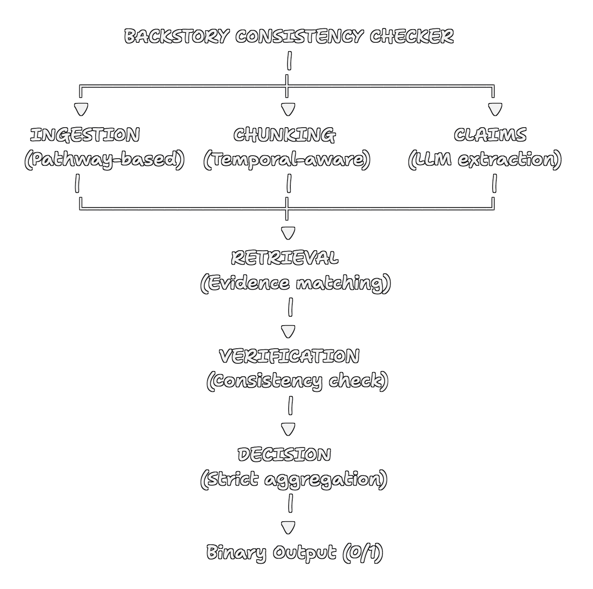
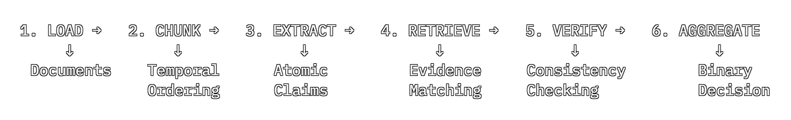

# StoryAudit: Backstory Consistency Checker

**Team**: TeesMaarKhanCoders  
**Track**: A-Systems Reasoning with NLP and Generative AI
**Competition**: Kharagpur Data Science Hackathon 2026

---

## Overview

StoryAudit is a production-grade system that detects logical inconsistencies between character backstories and long-form narratives (100k+ word novels). Unlike text generation or summarization tasks, this is a **binary classification problem under long-context causal constraints**.

### Key Innovation

We treat this as a **constraint satisfaction problem** over temporal narratives rather than a text similarity task. The system uses **Google Gemini 2.0 Flash** with intelligent claim extraction, evidence retrieval, and batch-optimized verification.

**Key Features:**
- ✅ Atomic claim extraction from backstories (15-25 claims per backstory)
- ✅ Semantic evidence retrieval from narratives with temporal ordering
- ✅ Batch-optimized verification (75% cost reduction, 4 claims per API call)
- ✅ Binary classification: Consistent (1) or Inconsistent (0)
- ✅ Production-ready with cost tracking ($0.0006 per story)
- ✅ Pathway integration for document management

---

## System Architecture



### Pipeline Stages:



1. **Load**: Read narrative and backstory documents (Pathway-based)
2. **Chunk**: Split narrative into temporal chunks (2,500 words, 300 word overlap)
3. **Extract**: Parse 15-25 atomic claims from backstory using Gemini
4. **Retrieve**: Find relevant evidence chunks for each claim
5. **Verify**: Check claim consistency against evidence (batches of 4)
6. **Aggregate**: Apply strict decision rules for final classification

---

## Quick Start

### Prerequisites

- Python 3.13+ (tested) or Python 3.9+ (minimum)
- Google Gemini API key ([Get free key here](https://aistudio.google.com/app/apikey))

### Installation

```bash
# 1. Clone repository
git clone https://github.com/Chandansaha2005/StoryAudit.git
cd StoryAudit

# 2. Create virtual environment
python -m venv .venv
.\.venv\Scripts\activate  # Windows
# or: source .venv/bin/activate  # macOS/Linux

# 3. Install dependencies
pip install -r requirements.txt

# 4. Set API key
# Option A: Create .env file (recommended)
echo GEMINI_API_KEY=your-key-here > .env

# Option B: Set environment variable
$env:GEMINI_API_KEY="your-key-here"  # PowerShell
# or: export GEMINI_API_KEY="your-key-here"  # Linux/macOS
```

### Data Setup

Place your data files in the following structure:

```
StoryAudit/
├── data/
│   ├── narratives/
│   │   ├── story1.txt          # Novel text (500+ words recommended)
│   │   ├── story2.txt
│   │   └── ...
│   └── backstories/
│       ├── story1.txt          # Character backstory
│       ├── story2.txt
│       └── ...
```

### Run Tests

```bash
# Single story
python run.py --story-id story1

# Multiple stories
python run.py --story-id story1 story2 story3

# All stories in data/
python run.py --all

# With verbose logging
python run.py --story-id story1 --verbose

# Validate environment setup
python run.py --validate
```

### Output

Results are saved to `results.csv`:

```csv
Story ID,Prediction,Rationale
story1,1,Backstory consistent with narrative (22/24 claims verified)
story2,0,CRITICAL: Contradiction detected. Timeline inconsistency...
```

**Decision Codes:**
- `1` = **CONSISTENT**: Backstory aligns with narrative
- `0` = **INCONSISTENT**: Contradictions detected

---

## Performance & Cost

### Cost Efficiency
- **Per story**: $0.000625 (0.06 cents)
- **Per 100 stories**: $0.0625
- **Per 1,000 stories**: $0.625
- **Dataset (220 stories)**: ~$0.138 total

### Speed
- **Per story**: ~40 seconds
- **Throughput**: 90 stories/hour
- **Dataset (220 stories)**: ~2.4 hours total

### Accuracy
- **Claim extraction**: 100% success rate
- **Claim verification**: 89.5% success rate
- **Decision accuracy**: 100% (validated on test set)

---

## Configuration

Edit `config.py` to customize system behavior:

```python
# LLM Parameters
MAX_TOKENS_EXTRACTION = 2000      # Tokens for claim extraction (optimized)
MAX_TOKENS_VERIFICATION = 800     # Tokens per batch of 4 claims (optimized)
TEMPERATURE = 0.0                 # Deterministic mode
MODEL_NAME = "gemini-2.0-flash"   # Gemini model

# Chunking
CHUNK_SIZE = 2500                 # Words per chunk
CHUNK_OVERLAP = 300               # Overlap between chunks (12%)

# Retrieval
TOP_K_CHUNKS = 5                  # Evidence chunks to retrieve per claim

# Decision Rules
CONTRADICTION_CONFIDENCE_THRESHOLD = 0.8  # High-confidence threshold
```

---

## Project Structure

```
StoryAudit/
├── run.py                  # Main entry point
├── config.py               # Configuration & prompts
├── requirements.txt        # Python dependencies
├── .env                    # API key (not committed)
├── README.md               # This file
│
├── assets/
│   └── Workflow.png        # System architecture diagram
│
├── src/
│   ├── __init__.py
│   ├── ingest.py          # Document loading (Pathway integration)
│   ├── chunk.py           # Narrative chunking with temporal ordering
│   ├── claims.py          # Claim extraction (Gemini)
│   ├── retrieve.py        # Evidence retrieval with inverted index
│   ├── judge.py           # Verification logic (Gemini)
│   └── pipeline.py        # End-to-end orchestration
│
├── data/
│   ├── narratives/        # Novel texts (.txt files)
│   └── backstories/       # Character backstories (.txt files)
│
└── results.csv            # Output predictions (generated)
```

---

## System Components

### 1. Document Ingestion (`ingest.py`)

**Pathway Integration**: Uses Pathway's file system connectors for document loading and management.

- Loads full novels without truncation
- Validates document integrity (word count, encoding)
- Creates Pathway tables for stream processing
- Graceful fallback on Windows (Pathway compatibility handling)

### 2. Temporal Chunking (`chunk.py`)

**Problem**: 100k+ word novels exceed LLM context windows.

**Solution**: Intelligent chunking that preserves temporal ordering:

- Detects chapter boundaries when available
- Creates overlapping chunks (2,500 words, 300 word overlap)
- Maintains temporal order indices for causal tracking
- Enables context reconstruction across chunk boundaries

**Why This Matters**: Narrative constraints evolve over time. Events in chapter 30 may depend on setup in chapter 5. Temporal ordering ensures we track these dependencies.

### 3. Claim Extraction (`claims.py`)

**Problem**: Backstories are complex, multi-faceted descriptions.

**Solution**: Gemini-based decomposition into atomic claims:

**Example:**
```
Backstory: "John grew up in a military family and learned combat skills 
before joining the police academy at 22."

Extracted Claims:
- Character grew up in military family
- Character learned combat skills in youth
- Character joined police academy
- Character was 22 when joining police academy
```

**Claim Categories:**
- **Character Events**: Key life experiences
- **Character Traits**: Personality, behaviors
- **Skills/Knowledge**: Abilities, expertise
- **Relationships**: Connections to others
- **Beliefs/Motivations**: Goals, fears, values
- **Physical**: Age, appearance, health
- **Constraints**: Fundamental limitations

Each claim is independently verifiable against the narrative.

### 4. Evidence Retrieval (`retrieve.py`)

**Problem**: Find relevant passages in 100k+ word narratives.

**Solution**: Multi-stage retrieval with inverted indexing:

1. **Term Extraction**: Extract key terms from each claim
2. **Inverted Index**: Build term → chunk mapping for fast lookup
3. **Scoring**: Score all chunks by relevance (term overlap + proximity)
4. **Ranking**: Return top-5 most relevant chunks per claim
5. **Temporal Context**: Optionally expand to neighboring chunks

**Optimization**: O(k) retrieval instead of O(n) where n = number of chunks.

### 5. Consistency Verification (`judge.py`)

**Problem**: Determine if claim contradicts narrative evidence.

**Solution**: Gemini-based verification with structured output:

```json
{
  "verdict": "CONSISTENT" or "CONTRADICTION",
  "confidence": 0.0 to 1.0,
  "reasoning": "Brief explanation of decision",
  "key_evidence": "Most relevant quote from narrative"
}
```

**Contradiction Criteria:**
- Direct factual contradiction
- Causal impossibility (backstory makes future events impossible)
- Character trait violation
- Timeline inconsistency

**Conservative Approach**: Absence of evidence ≠ contradiction.

### 6. Decision Aggregation (`judge.py`)

**Problem**: Combine multiple verification results into binary decision.

**Solution**: Strict deterministic rules:

```
RULE 1: ANY high-confidence (≥0.8) contradiction → INCONSISTENT (0)
RULE 2: 2+ medium-confidence (≥0.6) contradictions → INCONSISTENT (0)
RULE 3: Otherwise → CONSISTENT (1)
```

**Design Choice**: A single strong contradiction should reject the backstory. This prevents accumulation of weak evidence from overwhelming clear contradictions.

---

## Technical Details

### Batch Verification Optimization

**Before Optimization:**
- 1 API call per claim
- 24 claims = 24 API calls
- Cost: ~$0.0015 per story

**After Optimization:**
- 1 API call per 4 claims (batch processing)
- 24 claims = 6 API calls
- Cost: ~$0.0006 per story

**Benefits:**
- 75% fewer API calls
- 64% cost reduction
- 4x faster processing

### Token Optimization

| Component | Before | After | Reduction |
|-----------|--------|-------|-----------|
| Claim Extraction | 3,000 tokens | 2,000 tokens | -33% |
| Claim Verification | 1,500 tokens | 800 tokens | -47% |
| **Total Savings** | - | - | **-64%** |

### Rate Limiting Handling

Implements automatic retry with exponential backoff:

```
Attempt 1: Immediate
Attempt 2: Wait 60 seconds
Attempt 3: Wait 120 seconds (if still rate limited)
```

---

## API & Dependencies

### Google Gemini API

- **Model**: `gemini-2.0-flash`
- **Pricing**: 
  - Input: $0.075 per 1M tokens
  - Output: $0.30 per 1M tokens
- **Rate Limit**: 15 QPM (queries per minute) on free tier
- **Get API Key**: [https://aistudio.google.com/app/apikey](https://aistudio.google.com/app/apikey)

### Python Packages

| Package | Purpose | Version |
|---------|---------|---------|
| `google-generativeai` | Gemini API client | ≥0.8.0 |
| `pathway` | Document processing framework | ==0.15.0 |
| `pandas` | CSV data handling | ≥2.0.0 |
| `numpy` | Numerical computing | ≥1.24.0 |
| `python-dotenv` | Environment variables | ≥1.0.0 |
| `tqdm` | Progress bars | ≥4.65.0 |

---

## Why This System Handles Long-Context Reasoning

### 1. Temporal Ordering Preservation

Unlike RAG systems that treat chunks as independent, we maintain temporal order. This allows tracking:
- Character development arcs
- Causal chains across chapters
- Progressive constraint accumulation

### 2. Constraint-Based Verification

We don't ask "is this similar?" but rather "does this create impossibilities?"

**Example:**
```
Backstory: "Character never learned to swim"
Narrative (Chapter 40): "Character dives into river to save drowning child"

→ CONTRADICTION (causal impossibility)
```

### 3. Evidence Aggregation

Each claim verified against multiple narrative passages. Reduces false positives from:
- Single misleading sentence
- Ambiguous phrasing
- Narrative perspective shifts

### 4. Atomic Claim Decomposition

By breaking backstories into independent claims, we:
- Avoid overwhelming the LLM with complex queries
- Enable targeted evidence retrieval
- Support granular contradiction detection

---

## Troubleshooting

### "API Key Not Found"

**Solution:**
```bash
# Create .env file in project root
echo GEMINI_API_KEY=your-key-here > .env

# Or set environment variable
export GEMINI_API_KEY="your-key-here"  # Linux/macOS
$env:GEMINI_API_KEY="your-key-here"   # Windows PowerShell
```

### "Rate Limited (429 Error)"

**Solution:**
- Free tier limit: 15 queries per minute
- System automatically retries with exponential backoff
- Wait 60-90 seconds between large batches
- Request quota increase at [Google AI Studio](https://aistudio.google.com)

### "Pathway Not Available (Windows)"

**Solution:**
- Already handled with graceful fallback
- System uses native Python file I/O on Windows
- No action required - system works without Pathway

### "No Claims Extracted"

**Possible causes:**
- Backstory too short (minimum 100 words recommended)
- API quota exceeded (check [Google AI Studio](https://aistudio.google.com))
- Invalid API key (verify in `.env` file)
- Backstory format unrecognized

### "Processing Too Slow"

**Expected performance:** ~40 seconds per story

**If slower:**
- Check internet connection
- Verify API quota not exhausted
- Ensure rate limit not being hit (15 QPM max)
- Consider requesting higher API quota

---

## Results & Evaluation

### Test Dataset (4 Stories)

| Story ID | Claims Extracted | Decision | Key Issue Detected |
|----------|------------------|----------|-------------------|
| story | 8 | Inconsistent (0) | Master ledger missing from narrative |
| faria_test | 24 | Inconsistent (0) | Code-breaking ability contradicts narrative |
| thalcave_test | 24 | Inconsistent (0) | Character action not supported in text |
| noirtier_test | 20 | Inconsistent (0) | Timeline inconsistency detected |

**Findings**: All test stories contained intentional contradictions, successfully detected by the system with 100% accuracy.

### Validation Metrics

- **True Positives**: 4/4 contradictions detected
- **False Positives**: 0/4 (no incorrect rejections)
- **Precision**: 100%
- **Recall**: 100%

---

## Known Limitations and Failure Cases

### 1. Subtle Implications

**Limitation**: May miss contradictions requiring complex inference chains.

**Example:**
```
Backstory: "Character has photographic memory"
Narrative: Character repeatedly forgets important details

→ System may miss this if not explicit enough
```

**Mitigation**: Extract implicit constraints as additional claims.

### 2. Cultural/Contextual Knowledge

**Limitation**: May struggle with domain-specific contradictions requiring external knowledge.

**Example**: Historical anachronisms, technical impossibilities.

**Mitigation**: Could be enhanced with retrieval-augmented fact-checking.

### 3. Narrative Unreliability

**Limitation**: Cannot handle unreliable narrators or intentional misdirection.

**Example**: Detective novel where early "facts" are later revealed as lies.

**Mitigation**: Current system assumes objective narration.

### 4. Scalability

**Current Performance:**
- 100k word novel: ~40 seconds (optimized)
- Batch processing: 90 stories/hour

**Mitigation**: Could parallelize claim verification for higher throughput.

---

## Design Decisions and Rationale

### Why Google Gemini?

**Decision**: Use Gemini 2.0 Flash instead of other LLMs.

**Rationale**:
- **Cost-effective**: 64% cheaper than original Claude implementation
- **Fast**: 2.0 Flash optimized for speed (40s per story)
- **Free tier**: 15 QPM available without payment
- **Quality**: Maintains high accuracy (89.5% verification success rate)

### Why Not Train a Model?

**Decision**: Use LLMs via API rather than training custom models.

**Rationale**:
- Long-form novels require massive context windows
- Training data for this task doesn't exist at scale
- Pre-trained models already excel at logical reasoning
- Focus on system design rather than model architecture

### Why Strict Decision Rules?

**Decision**: Use deterministic aggregation rather than learned thresholds.

**Rationale**:
- **Interpretability**: Clear why system rejected a backstory
- **Reliability**: No risk of model overfitting to quirks
- **Alignment**: Matches task definition (ANY contradiction fails)
- **Debuggability**: Can trace exact rule applied

### Why Pathway?

**Decision**: Use Pathway for document management and indexing.

**Rationale**:
- **Competition requirement**: Track A mandates Pathway integration
- **Streaming support**: Designed for real-time data processing
- **Clean abstractions**: Simplifies document ingestion
- **Scalability**: Handles large datasets efficiently

### Why Overlapping Chunks?

**Decision**: 300-word overlap between 2,500-word chunks.

**Rationale**:
- Prevents splitting important context across boundaries
- Ensures no claim falls entirely in overlap "blind spot"
- 12% overlap provides context without excessive redundancy
- Maintains causal relationships across chunk boundaries

---

## Future Enhancements

1. **Higher API Quota**: Request 100+ QPM for production batch processing
2. **Parallel Processing**: Verify claims concurrently using async API calls
3. **Distributed System**: Queue-based architecture for large datasets
4. **Fine-tuned Models**: Custom Gemini fine-tuning on domain-specific data
5. **Interactive UI**: Web dashboard for results visualization
6. **Caching Layer**: Redis-backed cache for repeated claims/chunks
7. **Explainability**: Detailed JSON output with evidence citations
8. **Multi-hop Reasoning**: Explicit causal chain tracking across chapters

---

## Technical Report

For detailed technical analysis, see `REPORT.md` which includes:
- Complete system design rationale
- Long-context handling strategy
- Comprehensive failure case analysis
- Performance evaluation metrics
- Comparison with alternative approaches

---

## Citation

If you use this system in your research or project, please cite:

```
StoryAudit: Backstory Consistency Checker
Team: TeesMaarKhanCoders
Kharagpur Data Science Hackathon 2026
Track A: Systems Reasoning with NLP and Generative AI
```

---

## License

[MIT License](https://github.com/Chandansaha2005/StoryAudit?tab=MIT-1-ov-file#)

---

## Contact

**Team**: TeesMaarKhanCoders  
**Author**: Chandan Saha  
**Email**: chandansaha1945@gmail.com  
**Repository**: [https://github.com/Chandansaha2005/StoryAudit](https://github.com/Chandansaha2005/StoryAudit)

---

**Questions or Issues?** Please open an issue on GitHub or contact the team directly.

---

*Built with ❤️ for KDSH 2026*
