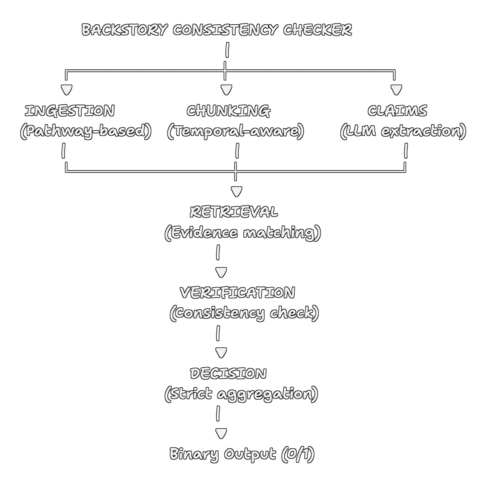

# StoryAudit: Backstory Consistency Checker

**Team**: TeesMaarKhanCoders \
**Track**: A (Systems Reasoning with NLP and Generative AI)

## Overview

This system evaluates whether hypothetical character backstories are logically consistent with long-form narratives (100k+ word novels). Unlike text generation or summarization tasks, this is a **binary classification problem under long-context causal constraints**.

### Key Innovation

We treat this as a **constraint satisfaction problem** over temporal narratives rather than a text similarity task. The system:

1. Decomposes backstories into atomic, testable claims
2. Retrieves relevant narrative evidence for each claim
3. Verifies causal and logical consistency
4. Applies strict decision rules for final classification

## System Architecture



## Installation

### Prerequisites

- Python 3.9+
- Anthropic API key

### Setup

```bash
# Clone repository
git clone <your-repo>
cd kdsh_track_a

# Install dependencies
pip install -r requirements.txt

# Set API key
export ANTHROPIC_API_KEY="your-key-here"

# Or create .env file
echo "ANTHROPIC_API_KEY=your-key" > .env
```

### Data Setup

Place data files in the following structure:

```
kdsh_track_a/
├── data/
│   ├── narratives/
│   │   ├── story_1.txt
│   │   ├── story_2.txt
│   │   └── ...
│   └── backstories/
│       ├── backstory_1.txt
│       ├── backstory_2.txt
│       └── ...
```

## Usage

### Process Single Story

```bash
python run.py --story-id 1
```

### Process Multiple Stories

```bash
python run.py --story-ids 1 2 3 4 5
```

### Process All Stories

```bash
python run.py --all
```

### Advanced Options

```bash
# Verbose logging
python run.py --story-id 1 --verbose

# Enhanced Pathway integration
python run.py --story-id 1 --pathway

# Custom output file
python run.py --all --output my_results.csv

# Validate environment
python run.py --validate
```

## Output Format

Results are saved to `results.csv`:

```csv
Story ID,Prediction,Rationale
1,1,"Backstory consistent with narrative (15/15 claims verified)"
2,0,"High-confidence contradiction detected: Character trained in combat..."
```

- **Prediction**: `1` = Consistent, `0` = Inconsistent
- **Rationale**: Brief explanation (1-2 lines)

## System Components

### 1. Document Ingestion (`ingest.py`)

**Pathway Integration**: Uses Pathway's file system connectors for document loading and management.

- Loads full novels (no truncation)
- Validates document integrity
- Creates Pathway tables for stream processing

### 2. Temporal Chunking (`chunk.py`)

**Problem**: 100k+ word novels exceed LLM context windows.

**Solution**: Intelligent chunking that preserves temporal ordering:

- Detects chapter boundaries when available
- Creates overlapping chunks (2500 words, 300 word overlap)
- Maintains temporal order indices
- Enables context reconstruction

**Why This Matters**: Narrative constraints evolve over time. Events in chapter 30 may depend on setup in chapter 5. Temporal ordering ensures we can track these dependencies.

### 3. Claim Extraction (`claims.py`)

**Problem**: Backstories are complex, multi-faceted descriptions.

**Solution**: LLM-based decomposition into atomic claims:

```
Backstory: "John grew up in a military family and learned combat skills 
before joining the police academy at 22."

Claims:
- Character grew up in military family
- Character learned combat skills in youth
- Character joined police academy
- Character was 22 when joining police academy
```

**Categories**:
- Character events
- Skills/knowledge
- Personality traits
- Relationships
- Beliefs/motivations
- Physical constraints

Each claim is independently verifiable.

### 4. Evidence Retrieval (`retrieve.py`)

**Problem**: Find relevant passages in 100k+ word narrative.

**Solution**: Multi-stage retrieval:

1. **Term Extraction**: Extract key terms from each claim
2. **Scoring**: Score all chunks by relevance (term overlap + proximity)
3. **Ranking**: Return top-k most relevant chunks
4. **Temporal Context**: Optionally expand to neighboring chunks

**Optimization**: Inverted index for fast term lookup (Pathway-backed).

### 5. Consistency Verification (`judge.py`)

**Problem**: Determine if claim contradicts narrative.

**Solution**: LLM-based verification with structured output:

```json
{
  "verdict": "CONSISTENT" or "CONTRADICTION",
  "confidence": 0.0 to 1.0,
  "reasoning": "...",
  "key_evidence": "..."
}
```

**Contradiction Criteria**:
- Direct factual contradiction
- Causal impossibility
- Character trait violation
- Timeline inconsistency

**Conservative Approach**: Absence of evidence ≠ contradiction.

### 6. Decision Aggregation (`judge.py`)

**Problem**: Combine multiple verification results into binary decision.

**Solution**: Strict logical rules:

```
RULE 1: ANY high-confidence (≥0.8) contradiction → INCONSISTENT
RULE 2: Multiple (2+) medium-confidence (≥0.6) contradictions → INCONSISTENT
RULE 3: Otherwise → CONSISTENT
```

**Design Choice**: A single strong contradiction should reject the backstory. This prevents accumulation of weak evidence from overwhelming clear contradictions.

## Why This System Handles Long-Context Reasoning

### 1. Temporal Ordering Preservation

Unlike RAG systems that treat chunks as independent, we maintain temporal order. This allows tracking:
- Character development arcs
- Causal chains across chapters
- Progressive constraint accumulation

### 2. Constraint-Based Verification

We don't ask "is this similar?" but rather "does this create impossibilities?"

Example:
```
Backstory: "Character never learned to swim"
Narrative (Chapter 40): "Character dives into river to save drowning child"

→ CONTRADICTION (causal impossibility)
```

### 3. Evidence Aggregation

Each claim verified against multiple narrative passages. Reduces false positives from:
- Single misleading sentence
- Ambiguous phrasing
- Narrative perspective shifts

### 4. Atomic Claim Decomposition

By breaking backstories into independent claims, we:
- Avoid overwhelming the LLM with complex queries
- Enable targeted evidence retrieval
- Support granular contradiction detection

## Known Limitations and Failure Cases

### 1. Subtle Implications

**Limitation**: May miss contradictions that require complex inference chains.

**Example**:
```
Backstory: "Character has photographic memory"
Narrative: Character repeatedly forgets important details

→ System may miss this if not explicit enough
```

**Mitigation**: Extract implicit constraints as additional claims.

### 2. Cultural/Contextual Knowledge

**Limitation**: May struggle with domain-specific contradictions requiring external knowledge.

**Example**: Historical anachronisms, technical impossibilities.

**Mitigation**: Could be enhanced with retrieval-augmented fact-checking.

### 3. Narrative Unreliability

**Limitation**: Cannot handle unreliable narrators or intentional misdirection.

**Example**: Detective novel where early "facts" are later revealed as lies.

**Mitigation**: Current system assumes objective narration.

### 4. Scalability

**Limitation**: Processing time scales with narrative length × claim count.

**Typical Performance**:
- 100k word novel: ~15-20 minutes
- Batch processing: ~2-3 stories/hour

**Mitigation**: Could parallelize claim verification.

## Design Decisions and Rationale

### Why Not Train a Model?

**Decision**: Use LLMs via API rather than training custom models.

**Rationale**:
- Long-form novels require massive context windows
- Training data for this task doesn't exist at scale
- Pre-trained models already excel at logical reasoning
- Focus on system design rather than model architecture

### Why Strict Decision Rules?

**Decision**: Use deterministic aggregation rather than learned thresholds.

**Rationale**:
- Interpretability: Clear why system rejected a backstory
- Reliability: No risk of model overfitting to quirks
- Alignment: Matches task definition (ANY contradiction fails)

### Why Pathway?

**Decision**: Use Pathway for document management and indexing.

**Rationale**:
- Designed for streaming data and real-time processing
- Clean abstractions for document ingestion
- Scalable to larger datasets
- Native support for incremental processing

### Why Overlapping Chunks?

**Decision**: 300-word overlap between 2500-word chunks.

**Rationale**:
- Prevents splitting important context across boundaries
- Ensures no claim falls entirely in overlap "blind spot"
- 12% overlap provides context without excessive redundancy

## Evaluation Metrics

The system is evaluated on:

1. **Accuracy**: Correct binary classification
2. **Robustness**: Performance across diverse narrative styles
3. **Reasoning Quality**: Evidence-based decisions
4. **Long-Context Handling**: Effective use of full narrative

## Future Enhancements

1. **Parallel Processing**: Verify claims in parallel
2. **Caching**: Cache embeddings and chunk scores
3. **Active Learning**: Prioritize ambiguous cases for human review
4. **Confidence Calibration**: Learn optimal thresholds from feedback
5. **Multi-hop Reasoning**: Explicit causal chain tracking

## Technical Report

See `REPORT.md` for detailed technical report including:
- System design rationale
- Long-context handling strategy
- Failure case analysis
- Performance evaluation

## Citation

If you use this system, please cite:

```
KDSH 2026 Track A: Backstory Consistency Checker
[Your Team Name]
Kharagpur Data Science Hackathon 2026
```

## License

[MIT LICENSE](https://github.com/Chandansaha2005/StoryAudit?tab=MIT-1-ov-file#)

## Contact

- Author: Chandan Saha
- Email: chandansaha1945@gmail.com